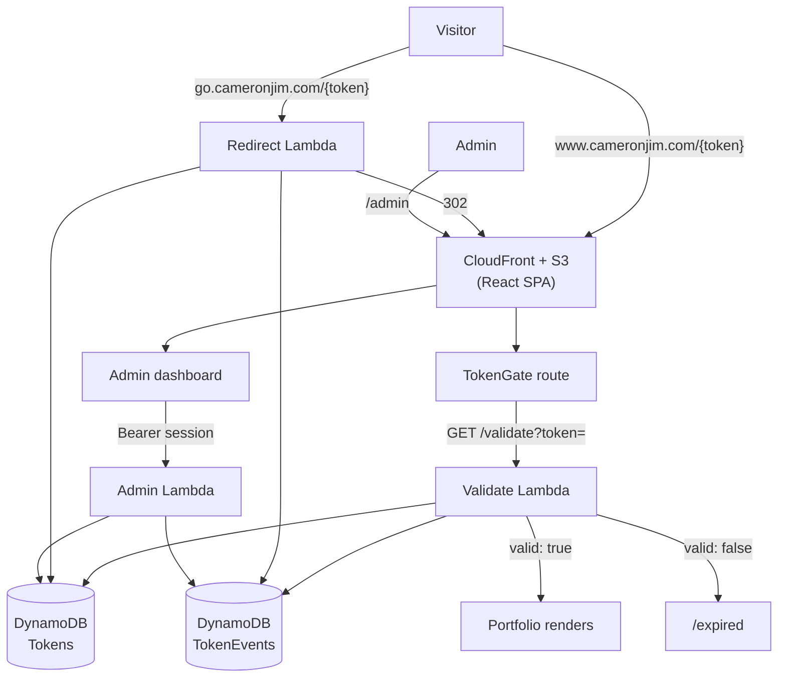

# Architecture

How the serverless pieces fit together. See [tokens.md](tokens.md) for the token
lifecycle and [deployment.md](deployment.md) for how code reaches AWS.

## AWS resources

Everything runs in `us-east-1`.

| Service | Purpose |
|---|---|
| Lambda | `bio-site-validate`, `bio-site-redirect`, `bio-site-admin` (Node 20) |
| API Gateway (HTTP API) | `api.cameronjim.com` (validate + admin), `go.cameronjim.com` (redirect) |
| DynamoDB | `Tokens`, `TokenEvents` — both with TTL enabled on `expiresAt` |
| S3 | Private bucket holding the built SPA |
| CloudFront | CDN in front of S3, with SPA fallback to `index.html` |
| Route 53 + ACM | DNS records and TLS certificates |
| IAM | Least-privilege deploy role, assumed by GitHub Actions via OIDC |

The original infrastructure was provisioned with AWS SAM/CloudFormation. The
template is not committed to this repository, and the deploy pipeline never
modifies infrastructure — see [deployment.md](deployment.md).

## Request flow

CloudFront serves `index.html` for unmatched paths, which is what lets React Router
handle `/{token}` and `/t/{token}` client-side.

## Lambda functions

All three run on `nodejs20.x` with handler `index.handler` and rely on the
**runtime-provided AWS SDK v3** — nothing is bundled, so deploy artifacts stay tiny.
`validate` and `redirect` are plain ESM (`.mjs`) shipped as-is; `admin` is
TypeScript compiled to CommonJS with `tsc` before packaging.

### `bio-site-validate`

`GET api.cameronjim.com/validate?token=…`

Looks up the token, rejects it if revoked or expired, logs a `validate` event, and
returns `{ valid, campaign, variant, destinationPath }`. Always responds `200` — the
`valid` flag carries the verdict, so a rejected token is indistinguishable from a
network perspective. CORS is pinned to the site origin.

### `bio-site-redirect`

`GET go.cameronjim.com/{token}`

Validates the token, logs an `open_go` event, then issues a `302` to
`www.cameronjim.com/t/{token}` (or the token's `destinationPath`) with
`Cache-Control: no-store`. Invalid tokens redirect to `/expired`.

### `bio-site-admin`

`api.cameronjim.com/admin/*` — every route requires authentication.

| Route | Method | Purpose |
|---|---|---|
| `/admin/verify` | GET | Check credentials, issue a session token |
| `/admin/tokens` | GET | List all links, newest first |
| `/admin/tokens` | POST | Create a link, or delete one via `{ action: 'delete' }` |
| `/admin/events` | GET | Recent events, optionally filtered by `?token=` |

> Deletes ride on `POST` with an action discriminator because no `DELETE` route is
> wired up in API Gateway. This keeps the feature purely in Lambda code with no
> infrastructure change.

## Data model

### `Tokens` — partition key `token`

| Attribute | Type | Notes |
|---|---|---|
| `token` | string | Access token or vanity slug (primary key) |
| `campaign` | string | Human label, ≤ 200 characters |
| `createdAt` | string | ISO 8601 |
| `expiresAt` | number | Unix seconds; **omitted** for indefinite links. TTL attribute |
| `expiresAtISO` | string | Human-readable mirror of `expiresAt` |
| `revoked` | boolean | Optional kill switch, checked on every validation |
| `destinationPath` | string | Optional custom redirect target |

### `TokenEvents` — partition key `token`, sort key `ts`

| Attribute | Type | Notes |
|---|---|---|
| `token` | string | Which link was used |
| `ts` | string | ISO 8601 timestamp (sort key) |
| `eventType` | string | `validate` (page view) or `open_go` (short-link hop) |
| `userAgent` | string | Raw user-agent string |
| `ipHash` | string \| null | Truncated HMAC-SHA256 of the IP, or `null` |
| `referrer` | string \| null | Referer header if present |
| `expiresAt` | number | TTL — events self-delete after `EVENTS_TTL_DAYS` (default 180) |

Because the partition key is `token`, per-link analytics is a `Query` rather than a
table scan. The dashboard's "all events" view is a bounded `Scan`.
